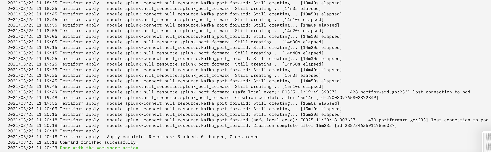

# Event Streams connector for Splunk

## Introduction

`Event Streams connector for Splunk` reads the logs / events from an IBM Event Streams topic and writes to a [Splunk](https://www.splunk.com/en_us/download/splunk-enterprise.html) instance.  This repo assumes that you are using the [Export to Event Streams](https://github.com/IBM/export-to-eventstreams) capability to stream the logs from **IBM Log Analysis** or **IBM Cloud Activity Tracker**.

It uses [Kafka Connect](https://docs.confluent.io/3.0.1/connect/intro.html), [Splunk Connect for Kafka](https://github.com/splunk/kafka-connect-splunk) deployed on an [IBM Kubernetes cluster](https://cloud.ibm.com/kubernetes/clusters).

As illustrated, the `Event Streams connector for Splunk` has following components:

* IBM Cloud Event Streams (as the log / event source)
* IBM Cloud Kubernetes service (to run `Kafka Connect` & the `Splunk Connect for Kafka`)
* Splunk (as the log sink)

This repo automates the deployment of the _Event Streams connector for Splunk_ capability using Terraform & IBM Cloud Schematics.

## Prerequisites:
1. You must have an IBM Event Streams (Enterprise plan), as a log source
   * The name of the Event Streams instance is your `event_stream_name`.
   * Configure the [Export to Event Streams](https://github.com/IBM/export-to-eventstreams) capability to publish the logs from IBM Cloud Logging to a Event Streams topic `event_stream_topic`;
1. You must have a Splunk Enterprise server instance already provisioned; and you know the following details about the log sink
   * `splunk_index`, `splunk_hec_uri` & `splunk_hec_token` to write the logs

## Deploy _Event Streams connector for Splunk_ using IBM Cloud Schematics

1. Click on [Deploy to IBM Cloud](https://cloud.ibm.com/schematics/workspaces/create?repository=https://github.com/IBM/ibm-cloud-connect-for-splunk&terraform_version=terraform_v0.13) to create a Schematics Workspace for _Event Streams connector for Splunk_.  By default, the following parameters will be pre-filled :
   * Repository URL (cannot be changed)
   * IBM Cloud Account (`ibmcloud_account`, displayed on the right-top corner of the IBM Cloud Console - can be changed)
   * Workspace name (`workspace_name` - can be changed)
   * Workspace tags (`workspace_tags` - can be changed)
   * Workspace resource group (`workspace_resource_group` for the workspace - can be changed)
   * Workspace location (`workspace_region` for the workspace - can be changed)
   > Note: The `workspace_tags`, `workspace_resource_group` & `workspace_region` - is independent, and is not related to the Logging & Event Streams services parameters.
1. Click the "create".
1. Review the following input variables, and update them according to your needs
   | Input variable	    | Description	           | Type	  | Default | Required ? | Sensitive ? |
   |--------------------|------------------------|--------|---------|------------|-------------|
   | ibmcloud_api_key   | Enter your IBM Cloud API Key, you can get your IBM Cloud API key using: https://cloud.ibm.com/iam#/apikeys | String |  | Yes | Yes | Yes |
   | create_cluster   | For creating new IBM Kubernetes cluster | String | false  | Yes | No |
   | cluster_name   | Name of IBM Kubernetes cluster | String |    | Yes | No |
   | event_stream_name   | Name of source Event Stream instance to connect to | String |    | Yes | No |
   | event_stream_region | Region of the source Event Stream instance (us-south, eu-de, etc.) | String | us-south | Yes | No |
   | event_stream_resource_group | Resource group name of the source Event Stream instance | String | Default | Yes | No |
   | event_stream_topic  | Name of source Event Stream topic | String |    | Yes | No |
   | splunk_index        | A repository for Splunk data | String |  | Yes | No |
   | splunk_hec_uri      | URL for the Splunk - HTTP Event Collector | String |  | Yes| No |
   | splunk_hec_token    | Auth token for the Splunk - HTTP Event Collector | String |  | Yes| No |
   | splunk_connector_name      | Name for the splunk connector(Must not already exist) | String |  | Yes| No |
   
1. Click the "Save Changes".
1. Click "Generate Plan".  And, view the progress in the Activities page.
1. Click "Apply Plan".  And, view the progress in the Activities page.

On successful deployment, 
* You will see the following log messages in Schematic workspace logs.

  
* You will see the following additional service instances in the [Resource List](https://cloud.ibm.com/resources) page.
   - Schematics workspaces : `workspace_name`

### Access permissions

You must provide the following minimum permissions, for any delegated user, to successfully deploy the _Export to Event Streams_ capability using the Terraform-based automation.
| Cloud Services       | Resource Group                | Permission                |
|----------------------|-------------------------------|---------------------------|
| Schematics           | `workspace_resource_group`    | Service role: Manager     |
| IBM Kubernetes Service | `event_stream_resource_group` | Platform role : Operator   Service role: Manager |
| Event Streams Topic  | `event_stream_resource_group` | Service role: Writer |

## Remove _Event Streams connector for Splunk_ using IBM Cloud Schematics

1. Open [IBM Cloud Schematics workspace](https://cloud.ibm.com/schematics/workspaces)
1. In the workspace list, select the `workspace_name` previously entered for this _Event Streams connector for Splunk_  capability, and press `Delete`
1. In the "Delete Workspace" pop-up window,
   * Select 'Delete workspace'
   * Select 'Delete all associated resources'
   * Type the and press the Delete button

## Image License Details
| Software | URL | Version | License | Provider |
| -------------- | -------------- | -------------- | -------------- | -------------- |
| Base image from Event Streams | [ibmcom/eventstreams-kafkaconnect](https://hub.docker.com/r/ibmcom/eventstreams-kafkaconnect) | 2019.2.1-3a2f93e | Apache License Version 2.0 | IBM |
| ibmjava | [ibmjava ](https://hub.docker.com/_/ibmjava) | 8-jre |  | IBM |
| Kafka | [kafka download ](https://kafka.apache.org/downloads) | 2.2.0 | Apache License Version 2.0 | Apache |
| kafka-connect-splunk | [Kafka Connect for Splunk](https://github.com/splunk/kafka-connect-splunk) | v2.0.2 | Apache License Version 2.0  | Splunk |
| Kafka Connect Splunk Transformer  | [Splunk Transformer](https://github.com/IBM/kafka-connect-splunk-transformer) | v0.0.4 | Apache License Version 2.0  | IBM |
---

